.. _noresm2.1_test_runs:

Release of NorESM2.1 -- results from longer simulations
=======================================================

Author: Dirk Olivié

Abstract
^^^^^^^^

We present results of some longer simulations with NorESM2.1, both in
fixed-SST as fully-coupled setup.  We compare NorESM2.1 and NorESM2,
and also test how the individual four CAM-Nor modifications related to
*ice-delimiter*, *heterogeneous freezing*, *coagulation*
and *dry deposition* contribute to the observed changes.

The TOA imbalance under 1850 conditions in fixed-SST simulations
becomes more positive (:math:`+0.52\,\textrm{W m}^{-2}`).  Although the impact of
the individual changes does not add-up linearly, the largest
individual contribution comes from the correction in the
*ice-delimiter* (:math:`+0.21\,\textrm{W m}^{-2}`).  The correction in
*coagulation* also gives a small positive contribution
(:math:`+0.05\,\textrm{W m}^{-2}`), whereas the correction in heterogeneous
freezing (:math:`-0.04\,\textrm{W m}^{-2}`) and dry deposition
(:math:`-0.11\,\textrm{W m}^{-2}`) give a negative contribution.  The aerosol
effective radiative forcing (ERF) is slightly less negative in
NorESM2.1 (:math:`-1.22\,\textrm{W m}^{-2}`) compared to NorESM2
(:math:`-1.39\,\textrm{W m}^{-2}`).

In the coupled simulations, we see a relatively modest but significant
change in the warming of the global ocean.  This seems to be mainly
caused by the change in *coagulation*.  Tests have only been done
with the LM-version of the model (:math:`1.9^\circ` x :math:`2.5^\circ`
horizontal resolution in the atmosphere), but we expect that similar
impacts can be found in the MM-version
(:math:`0.9^\circ` x :math:`1.25^\circ`).

Introduction
^^^^^^^^^^^^

NorESM2.1 is an updated version of NorESM2. Compared to NorESM2,
NorESM2.1 contains 4 bug-fixes in CAM-Nor (the atmosphere component of
NorESM), and some small bugfixes in iHAMOCC (the biogeochemistry of the
ocean). Here we test the behaviour of NorESM2.1 with some longer
simulations. We also individually investigate the 4 bug-corrections of
CAM-Nor.

In addition to these answer-changing changes, there are also
technical/estheitic changes to the model without impacting simulation
results (e.g., how one can activity extra aerosol diagnostics output),
but we do not focus on these latter changes here. The focus of this
document only on the four answer changing modifications in CAM-Nor.

The four answer-chaning modifications in CAM-Nor are related to :

#. ice number delimiter (in src/NorESM/micro_mg2_0.F90),

#. heterogeneous freezing (in chemistry/oslo_aero/hetfrz_classnuc_oslo.F90),

#. coagulation of aerosol into cloud droplets (in src/chemistry/oslo_aero/koagsub.F90), and

#. dry-deposition velocity of aerosol (in src/chemistry/oslo_aero/oslo_aerosols_intr.F90).

The second and third correction are related to errors in the model code
which lead to incorrect results, but additionally had the effect that
simulation results depended on the number of CPUs used for the
atmospheric component. In the corrected version of the model, results do
not depend anymore on the number of CPUs chosen for the atmosphere. For
the comparison here, we have used the NorESM2 CMIP6 results as reference
(which had a specific number of CPUs for the atmosphere). Having run
NorESM2 CMIP6 results with a different number of CPUs, would have given
different results, leadint to a different reference simulation.

The *ice-delimeter correction* considerably modifies the behoviour of
NorESM in the liquid/ice water path (see
Sect. :numref:`section:results`), impacting the short-wave and long-wave
cloud forcing. Therefore we have tested some additional modifications
(named SH/TS) changes to *micro_mg2_0.F90* and *clubb_intr.F90*. We have
not retained these additional modifications in NorESM2.1 – they will
however probably be part of NorESM2.3, accompagnied by additional tuning
of the parameters *club_gamma* and *micro_mg_dcs*.

The modification in iHAMOCC (biogeochemistry component of the ocean) are
active in the coupled simulations.

Most of the compsets in NorESM2 are still available in NorESM2.1, but
results will be (slightly) different. We have not spun-up NorESM2.1 to a
new (quasi-) equilibriun state, and ask users therefore to be careful
about possible drifts in fully-coupled simulations. The results below
(see Sect. :numref:`subsection:results_cpl`) will give an initial
indication of how strong the drift and the change in climate state is.
For fixed-SST simulations, there is less concern.

For the test presented here, have we used the LM-version of the model,
i.e., with the :math:`1.9 ^\circ` x :math:`2.5^\circ` horizontal
resolution in the atmosphere.

For the results shown here, we have limited ourselves to global- and
annual-mean values of specific model variables. However, the test
simulations are available and can be used for more thorough analysis.

The experiments performed are described in
Sect. :numref:`section:experiments`, and results of the experiments are
described in :numref:`section:results`.

.. _section:experiments:

Experiments
^^^^^^^^^^^

Compsets
--------

To characterize the difference between NorESM2 and NorESM2.1, we have
looked at three types of simulations :

#. Fixed-SST experiments under 1850 conditions (*NF1850norbc* compset).
   These experiments are usefull as they are not affected by decadal
   variability or long-term drifts which hamper the analysis of the
   difference between NorESM2 and NorESM2.1. One is often specifically
   interested in the TOA imbalance.

#. Fixed-SST experiments under 1850 conditions but with 2014 aerosol
   emissions (*NF1850norbc_aer2014 compset*). Comparing experiments with
   2014 and 1850 aerosol emissions allows to estimate the aerosol
   effective radiative forcing (ERF).

#. Fully-coupled simulations under 1850 conditions (*NF1850norbc*). If
   run over long enough time, they allow to get an idea of model drift
   in surface (2 m) air temperature, ocean volume temperate or AMOC.

Perturbation experiments
------------------------

To see which change in NorESM2.1 was responsible for which behaviour
change in the model, we have done experiments where the 4 modifications
in CAM-Nor are tested seperately (or a combination of them). In addition
have we tested an additional modification (*SH/TS*), which is not
implemented in NorESM2.1. The different types of model setups are :

#. **noresm2 (CMIP6)** This reference experiment with NorESM2 has been
   run in 2019 (and used for CMIP6).

#. **noresm2.1 (no CAM corr.)** This experiment uses NorESM2.1, but
   where all the four CAM-Nor changes are set back to NorESM2. This
   setup should give results very close to NorESM2 results. The changes
   in BLOM/iHAMOCC are still active.

#. Experiments where only 1 NorESM2.1 modification is active :

   #. **noresm2.1 (only ice-delimiter corr.)**

   #. **noresm2.1 (only het. freez. corr.)**

   #. **noresm2.1 (only koagsub corr.)**

   #. **noresm2.1 (only dry dep. corr.)**

#. **noresm2.1 (no koagsub corr.)** This experiment uses 3 modifications
   but not a 4th one (*no koagsub corr.*).

#. **noresm2.1 (no ice-delimiter corr.)** This experiment uses 3
   modifications but not a 4th one (*no ice-delimiter corr.*).

#. **noresm2.1** These simulations have used the new NorESM2.1 code.

#. **noresm2.1 + SH/TS** NorESM2.1 code is used plus some additional
   changes. These changes should in principle be accompagnied by
   additional paramater modifications (*micro_mg_dcs*, *clubb_gamma*),
   to bring the TOA imbalance back to earlier values.

.. table:: Overview of the simulations
   :name: tbl:simulations_overview

   +-------------+-------+-----------+-------------------+-------------+
   |Code         |Machine|NF1850norbc|NF1850norbc_aer2014|N1850        |
   +-------------+-------+-----------+-------------------+-------------+
   |             |       |fixed-SST  |fixed-SST          |fully-coupled|
   +-------------+-------+-----------+-------------------+-------------+
   |noresm2      |Fram   |ok         |ok                 |ok           |
   |(CMIP6)      |       |           |                   |             |
   +-------------+-------+-----------+-------------------+-------------+
   |noresm2.1    |Betzy  |ok         |ok                 |ok           |
   |(no CAM      |       |           |                   |             |
   |corr.)       |       |           |                   |             |
   +-------------+-------+-----------+-------------------+-------------+
   |noresm2.1    |       |ok         |                   |ok           |
   |(only        |       |           |                   |             |
   |ice-delimiter|       |           |                   |             |
   |corr.)       |Betzy  |           |                   |             |
   +-------------+-------+-----------+-------------------+-------------+
   |noresm2.1    |       |ok         |                   |ok           |
   |(only het.   |       |           |                   |             |
   |freez.       |       |           |                   |             |
   |corr.)       |Betzy  |           |                   |             |
   +-------------+-------+-----------+-------------------+-------------+
   |noresm2.1    |Betzy  |ok         |                   |ok           |
   |(only        |       |           |                   |             |
   |koagsub      |       |           |                   |             |
   |corr.)       |       |           |                   |             |
   +-------------+-------+-----------+-------------------+-------------+
   |noresm2.1    |Betzy  |ok         |                   |ok           |
   |(only dry    |       |           |                   |             |
   |dep. corr.)  |       |           |                   |             |
   +-------------+-------+-----------+-------------------+-------------+
   |**noresm2.1  |Betzy  |           |                   |ok           |
   |(no koagsub  |       |           |                   |             |
   |corr.)**     |       |           |                   |             |
   +-------------+-------+-----------+-------------------+-------------+
   |**noresm2.1  |Betzy  |ok         |ok                 |ok           |
   |(no          |       |           |                   |             |
   |ice-delimiter|       |           |                   |             |
   |corr.)**     |       |           |                   |             |
   +-------------+-------+-----------+-------------------+-------------+
   |             |Betzy  |ok         |ok                 |ok           |
   |**noresm2.1**|       |           |                   |             |
   +-------------+-------+-----------+-------------------+-------------+
   |noresm2.1 +  |Betzy  |ok         |                   |ok           |
   |SH/TS        |       |           |                   |             |
   +-------------+-------+-----------+-------------------+-------------+

Simulations
-----------

An overview of all the experiments can be found in
Table :numref:`tbl:simulations_overview`. More details (name and length
of the experiments) can be found in the
Table :numref:`tbl:simulations_details`.

The initial conditions of these simulations are the same as for the
reference noresm2 (CMIP6) simulation. For the fixed-SST simulations
(both NF1850norbc and NF1850norbc_aer2014) we started from 1751-01-01 of
N1850_f19_tn14_20190621, and for the fully-coupled simulations we
started from 1600-01-01 of N1950_f19_tn14_11062019.

.. _section:results:

Results
^^^^^^^

Fixed-SST simulations
---------------------

In the tables we use values from the period year 5–30 (neglecting the
first 4 years of the simulations).

TOA imbalance
~~~~~~~~~~~~~

Global-mean TOA imbalance is shown in Fig. :numref:`fig:fsst_fslnt`,
and the year 5–30 average is given in Table
:numref:`tab:fsst_fslnt`. In the reference similation noresm2 (CMIP6)
there is a standard imbalance of around :math:`0.9\,\textrm{ W
 m}^{-2}` (if we derive boundary conditions from a fully-coupled N1850
simulation to be used in a NF1850norbc fixed-SST simulation, we find a
TOA imbalance of around :math:`0.9 \,\textrm{W  m}^{-2}`).  The
*ice-delimiter corr.* has the strongest impact and increases the TOA
imbalance by around :math:`0.2\,\textrm{ W  m}^{-2}`. All 4 CAM-Nor
modifications in NorESM2.1 (*noresm2.1*) together give an extra TOA
imbalance of around :math:`0.5 \,\textrm{W  m}^{-2}`. Adding the
*SH/TS* changes leads to a very strong reduction of the TOA imbalance
by around :math:`-1.2 \,\textrm{W  m}^{-2}`.

.. table:: TOA imbalance :math:`[\textrm{W  m}^{-2}]` in fixed-SST simulations.
   :name: tab:fsst_fslnt

   +--------------------+---------------------------+---------------------------+
   |                    |Absolute                   |w.r.t. NorESM2             |
   |                    |                           |(CMIP6)                    |
   +--------------------+---------------------------+---------------------------+
   |                    |:math:`[\textrm{W m}^{-2}]`|:math:`[\textrm{W m}^{-2}]`|
   +--------------------+---------------------------+---------------------------+
   |noresm2 (CMIP6)     |:math:`0.93 (\pm\ 0.06)`   |–                          |
   |                    |                           |                           |
   +--------------------+---------------------------+---------------------------+
   |noresm2.1 (no CAM   |:math:`0.92 (\pm\ 0.07)`   |-0.01                      |
   |corr.)              |                           |                           |
   +--------------------+---------------------------+---------------------------+
   |noresm2.1 (only     |:math:`1.14 (\pm\ 0.05)`   |0.21                       |
   |ice-delimiter corr.)|                           |                           |
   +--------------------+---------------------------+---------------------------+
   |noresm2.1 (only het.|:math:`0.90 (\pm\ 0.08)`   |-0.04                      |
   |freez. corr.)       |                           |                           |
   +--------------------+---------------------------+---------------------------+
   |noresm2.1 (only     |:math:`0.98 (\pm\ 0.08)`   |0.05                       |
   |koagsub corr.)      |                           |                           |
   +--------------------+---------------------------+---------------------------+
   |noresm2.1 (only dry |:math:`0.83 (\pm\ 0.09)`   |-0.11                      |
   |dep. corr.)         |                           |                           |
   +--------------------+---------------------------+---------------------------+
   |noresm2.1 (no       |:math:`1.02 (\pm\ 0.08)`   |0.09                       |
   |ice-delimiter corr.)|                           |                           |
   +--------------------+---------------------------+---------------------------+
   |noresm2.1           |:math:`1.46 (\pm\ 0.09)`   |0.53                       |
   |                    |                           |                           |
   +--------------------+---------------------------+---------------------------+
   |noresm2.1 + SH/TS   |:math:`-0.27 (\pm\ 0.11)`  |-1.21                      |
   |                    |                           |                           |
   +--------------------+---------------------------+---------------------------+
   |                    |                           |                           |
   +--------------------+---------------------------+---------------------------+

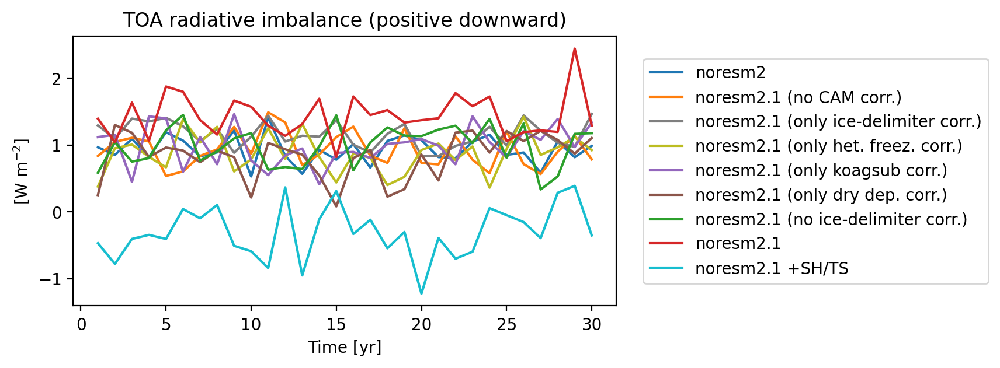

   TOA imbalance :math:`[\textrm{W  m}^{-2}]` in fixed-SST simulations.

SWCF and LWCF
~~~~~~~~~~~~~

Global-mean shortwave and longwave cloud forcing are shown in
Figs. :numref:`fig:fsst_swcf` and :numref:`fig:fsst_lwcf`, and the
averages over year 5–30 are given in Tables :numref:`tab:fsst_swcf`
and :numref:`tab:fsst_lwcf`. The *ice-delimiter corr.* leads to a
positive contribution in both SWCF and LWCF by around :math:`0.32` and
:math:`0.22\,\textrm{ W  m}^{-2}`, respectively. Also *dry dep. corr.* leads to a
positive contribution in both SWCF and LWCF by around :math:`0.25` and
:math:`0.15\,\textrm{ W  m}^{-2}`, respectively.

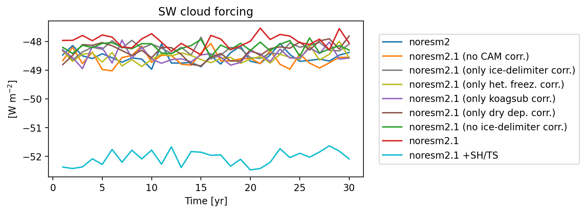

   Short wave cloud forcing :math:`[\textrm{W m}^{-2}]` in fixed-SST simulations.

.. table:: Short wave cloud forcing (SWCF) :math:`[\textrm{W  m}^{-2}]` in fixed-SST simulations.
   :name: tab:fsst_swcf

   +--------------------+---------------------------+---------------------------+
   |                    |Absolute                   |w.r.t. NorESM2             |
   |                    |                           |(CMIP6)                    |
   +--------------------+---------------------------+---------------------------+
   |                    |:math:`[\textrm{W m}^{-2}]`|:math:`[\textrm{W m}^{-2}]`|
   +--------------------+---------------------------+---------------------------+
   |noresm2 (CMIP6)     |:math:`-48.57 (\pm\ 0.06)` |–                          |
   |                    |                           |                           |
   +--------------------+---------------------------+---------------------------+
   |noresm2.1 (no CAM   |:math:`-48.63 (\pm\ 0.07)` |-0.06                      |
   |corr.)              |                           |                           |
   +--------------------+---------------------------+---------------------------+
   |noresm2.1 (only     |:math:`-48.25 (\pm\ 0.05)` |0.32                       |
   |ice-delimiter corr.)|                           |                           |
   +--------------------+---------------------------+---------------------------+
   |noresm2.1 (only het.|:math:`-48.56 (\pm\ 0.05)` |0.01                       |
   |freez. corr.)       |                           |                           |
   +--------------------+---------------------------+---------------------------+
   |noresm2.1 (only     |:math:`-48.49 (\pm\ 0.06)` |0.08                       |
   |koagsub corr.)      |                           |                           |
   +--------------------+---------------------------+---------------------------+
   |noresm2.1 (only dry |:math:`-48.32 (\pm\ 0.07)` |0.25                       |
   |dep. corr.)         |                           |                           |
   +--------------------+---------------------------+---------------------------+
   |noresm2.1 (no       |:math:`-48.20 (\pm\ 0.05)` |0.38                       |
   |ice-delimiter corr.)|                           |                           |
   +--------------------+---------------------------+---------------------------+
   |noresm2.1           |:math:`-48.00 (\pm\ 0.06)` |0.57                       |
   +--------------------+---------------------------+---------------------------+
   |noresm2.1 + SH/TS   |:math:`-52.01 (\pm\ 0.07)` |-3.44                      |
   +--------------------+---------------------------+---------------------------+
   |                    |                           |                           |
   +--------------------+---------------------------+---------------------------+

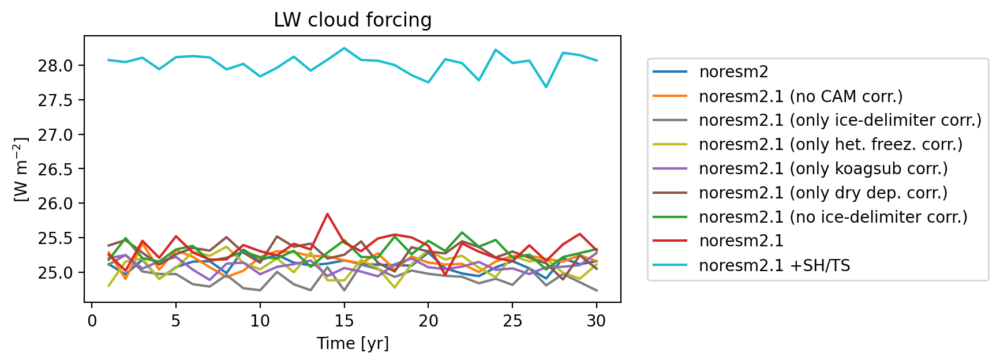

   Long wave cloud forcing :math:`[\textrm{W m}^{-2}]` in fixed-SST simulations.

.. table:: Long wave cloud forcing (LWCF) :math:`[\textrm{W  m}^{-2}]` in fixed-SST simulations.
   :name: tab:fsst_lwcf

   +--------------------+---------------------------+---------------------------+
   |                    |Absolute                   |w.r.t. NorESM2             |
   |                    |                           |(CMIP6)                    |
   +--------------------+---------------------------+---------------------------+
   |                    |:math:`[\textrm{W m}^{-2}]`|:math:`[\textrm{W m}^{-2}]`|
   +--------------------+---------------------------+---------------------------+
   |noresm2 (CMIP6)     |:math:`25.12 (\pm\ 0.03)`  |–                          |
   |                    |                           |                           |
   +--------------------+---------------------------+---------------------------+
   |noresm2.1 (no CAM   |:math:`25.17 (\pm\ 0.03)`  |0.05                       |
   |corr.)              |                           |                           |
   +--------------------+---------------------------+---------------------------+
   |noresm2.1 (only     |:math:`24.90 (\pm\ 0.03)`  |0.22                       |
   |ice-delimiter corr.)|                           |                           |
   +--------------------+---------------------------+---------------------------+
   |noresm2.1 (only het.|:math:`25.11 (\pm\ 0.04)`  |-0.01                      |
   |freez. corr.)       |                           |                           |
   +--------------------+---------------------------+---------------------------+
   |noresm2.1 (only     |:math:`25.07 (\pm\ 0.02)`  |-0.04                      |
   |koagsub corr.)      |                           |                           |
   +--------------------+---------------------------+---------------------------+
   |noresm2.1 (only dry |:math:`25.27 (\pm\ 0.04)`  |0.15                       |
   |dep. corr.)         |                           |                           |
   +--------------------+---------------------------+---------------------------+
   |noresm2.1 (no       |:math:`25.29 (\pm\ 0.03)`  |0.18                       |
   |ice-delimiter corr.)|                           |                           |
   +--------------------+---------------------------+---------------------------+
   |noresm2.1           |:math:`25.35 (\pm\ 0.05)`  |0.24                       |
   |                    |                           |                           |
   +--------------------+---------------------------+---------------------------+
   |noresm2.1 + SH/TS   |:math:`28.02 (\pm\ 0.04)`  |2.91                       |
   |                    |                           |                           |
   +--------------------+---------------------------+---------------------------+
   |                    |                           |                           |
   +--------------------+---------------------------+---------------------------+

Surface wind and DMS emissions
~~~~~~~~~~~~~~~~~~~~~~~~~~~~~~

Global-mean surface wind is shown in Fig :numref:`fig:fsst_u10_sfdms`
(upper panel). In NorESM2.1 the surface wind is around 1 % weaker than
in NorESM2.1, mainly caused by *ice delimiter corr.*. The
*noresm2.1+SH/TS* simulation shows a 1 % increase in surface (10 m) wind
strength.

As a consequence of the surface wind changes, also DMS emissions are
affected (see Fig :numref:`fig:fsst_u10_sfdms`, lower panel).

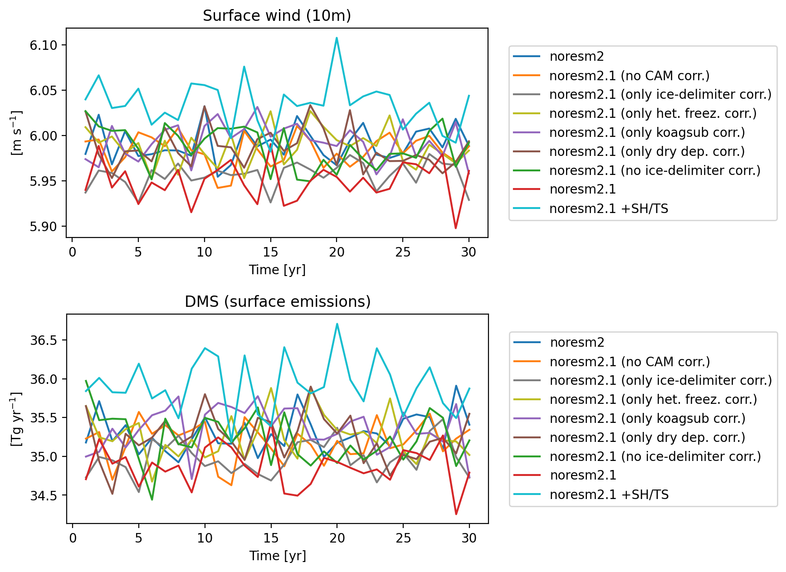

   Surface (10 m) wind :math:`[\textrm{m s}^{-1}]` and DMS emission strength :math:`[\textrm{Tg yr}^{-1}]`.

Ice crystal and cloud droplet number
~~~~~~~~~~~~~~~~~~~~~~~~~~~~~~~~~~~~

Global-mean vertically-integrated ice-crystal number is shown in
Fig. :numref:`fig:fsst_numice_numliq` (upper panel). In NoreESM2.1, the
ice crystal number is almost 50 % larger than in NorESM2. Around half of
the change is caused by *ice-delimiter corr.*, but also *dry dep. corr.*
contributes to the change.

Global-mean vertically-integrated cloud droplet number is shown in
Fig. :numref:`fig:fsst_numice_numliq` (lower panel). In NorESM2.1, the
cloud droplet number is around 15 % smaller than in NorESM2. Again,
around half of the change is caused by *ice-delimiter corr.*, with some
addtional contribution from *dry dep. corr.* and *koagsub corr.*.

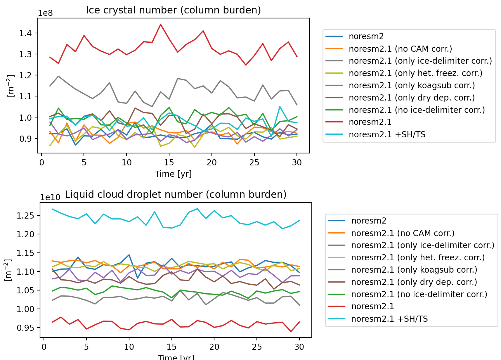

   Global-mean ice crystal number and cloud droplet number :math:`[\textrm{# m}^{-2}]` in fixed-SST simulations.

Cloud ice and liquid water path
~~~~~~~~~~~~~~~~~~~~~~~~~~~~~~~

Figure :numref:`fig:fsst_iwp_lwp` (upper panel) shows the ice cloud water
path (IWP), and it increases by around 12 % in NorESM2.1 w.r.t.
NorESM2., and is mainly caused by *ice-delimiter corr.*. The liquid
cloud water path (LWP) decreases by a bit less than 10 % in NorESM2.1
compared to NorESM2, mainly caused by *ice-delimiter corr.*.

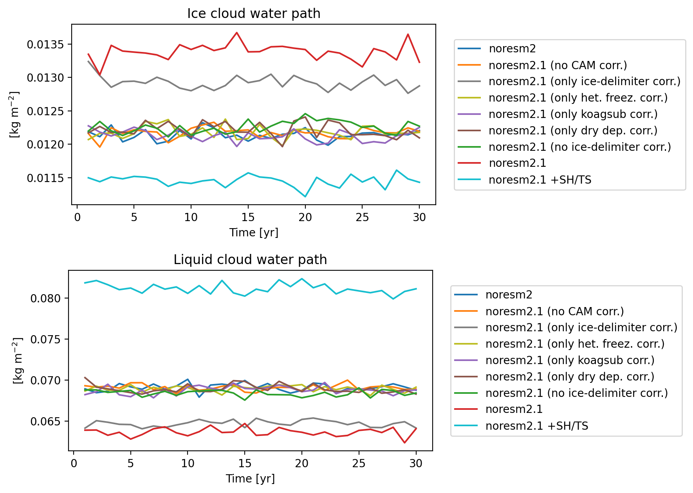

   Global-mean cloud ice and liquid water path :math:`[\textrm{kg m}^{-2}]` in fixed-SST simulations.

Aerosol optical depth
~~~~~~~~~~~~~~~~~~~~~

Table :numref:`tab:fsst_aod` shows the total aerosol optical depth in
the fixed-SST simulations. In NorESM2.1, the aerosol optical depth is
around 0.02 larger than in NorESM2. The increase is mainly caused by
*dry dep. corr.*, with an additional small contribution by
*ice-delimiter corr.*.

.. table:: Aerosol optical depth in fixed-SST experiments.
   :name: tab:fsst_aod

   +--------------------+----------------------------+--------------+
   |                    |Absolute                    |W.r.t. noresm2|
   |                    |                            |(CMIP6)       |
   +--------------------+----------------------------+--------------+
   |                    |[–]                         |[–]           |
   +--------------------+----------------------------+--------------+
   |noresm2 (CMIP6)     |:math:`0.1404 (\pm\ 0.0003)`|–             |
   +--------------------+----------------------------+--------------+
   |noresm2.1 (no CAM   |:math:`0.1404 (\pm\ 0.0004)`|0.0001        |
   |corr.)              |                            |              |
   +--------------------+----------------------------+--------------+
   |noresm2.1 (only     |:math:`0.1415 (\pm\ 0.0005)`|0.0012        |
   |ice-delimiter corr.)|                            |              |
   +--------------------+----------------------------+--------------+
   |noresm2.1 (only het.|:math:`0.1400 (\pm\ 0.0004)`|-0.0003       |
   |freez. corr.)       |                            |              |
   +--------------------+----------------------------+--------------+
   |noresm2.1 (only     |:math:`0.1401 (\pm\ 0.0004)`|-0.0003       |
   |koagsub corr.)      |                            |              |
   +--------------------+----------------------------+--------------+
   |noresm2.1 (only dry |:math:`0.1594 (\pm\ 0.0006)`|0.0190        |
   |dep. corr.)         |                            |              |
   +--------------------+----------------------------+--------------+
   |noresm2.1 (no       |:math:`0.1591 (\pm\ 0.0004)`|0.0187        |
   |ice-delimiter corr.)|                            |              |
   +--------------------+----------------------------+--------------+
   |noresm2.1           |:math:`0.1610 (\pm\ 0.0005)`|0.0207        |
   |                    |                            |              |
   +--------------------+----------------------------+--------------+
   |noresm2.1 + SH/TS   |:math:`0.1602 (\pm\ 0.0006)`|0.0198        |
   |                    |                            |              |
   +--------------------+----------------------------+--------------+
   |                    |                            |              |
   +--------------------+----------------------------+--------------+

Aerosol burden
~~~~~~~~~~~~~~

Figure :numref:`fig:fsst_bc_ac_ocw_burden` shows the global amount of
one of the tracers to describe BC. It tracks the amount of BC within
cloud droplets, having ended up there after coagulation with those cloud
droplets. This quantity has increased more than 5-fold in NorESM2.1
compared to NorESM2, mainly caused by *koagsub corr.*. The *dry dep.
corr.* slightly reduced this amount.

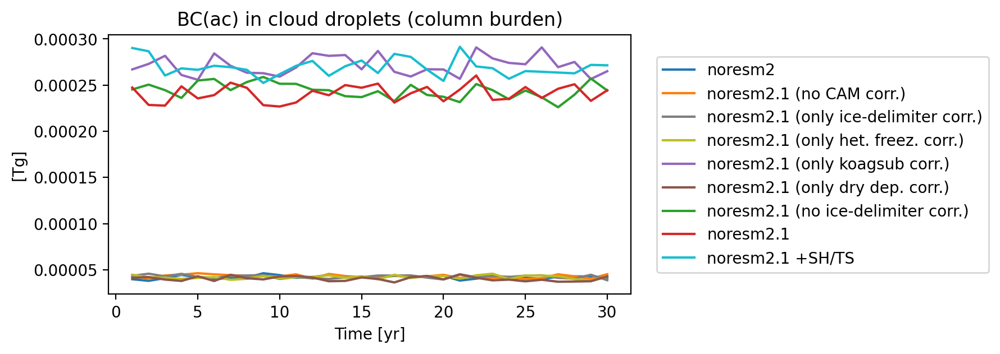

   Global total BC in cloud-droplets (after coagulation with could droplets) in fixed-SST simulations.

The global total aerosol burdens are shown in
Fig. :numref:`fig:fsst_aerosol_burden` and
Table :numref:`tab:fsst_aerosol_burden` for BC, OM, sulfate, dust and
sea-salt. For the individual aerosol species, we observe the following:

#. The total BC aerosol burden has not much changed when going from
   NorESM2 to NorESM2.1, mainly due to compsensating impacts from
   *ice-delimiter corr.* on the one hand (increase), and *koagsub corr.*
   and *dry dep. corr.* on the other hand.

#. The second panel of the same figure shows that the OM burden has
   slightly increased (5 %) when going from NorESM2 to NorESM2.1, mainly
   due to *ice-delimiter corr.*.

#. The third panel shows the sulfate burden, which increased by around
   5 % when going from NorESM2 to NorESM2.1 – more than half of this
   change is caused by *ice-delimter corr.*.

#. The fourth panel shows the dust aerosol burden, which increased by
   around 50 % when going from NorESM2 to NorESM2.1, principally caused
   by *dry dep. corr.*.

#. The fifth panel shows the sea-salt aerosol burden, which increased by
   around 25-30 % when going from NorESM2 to NorESM2.1, principally
   caused by *dry dep. corr.*.

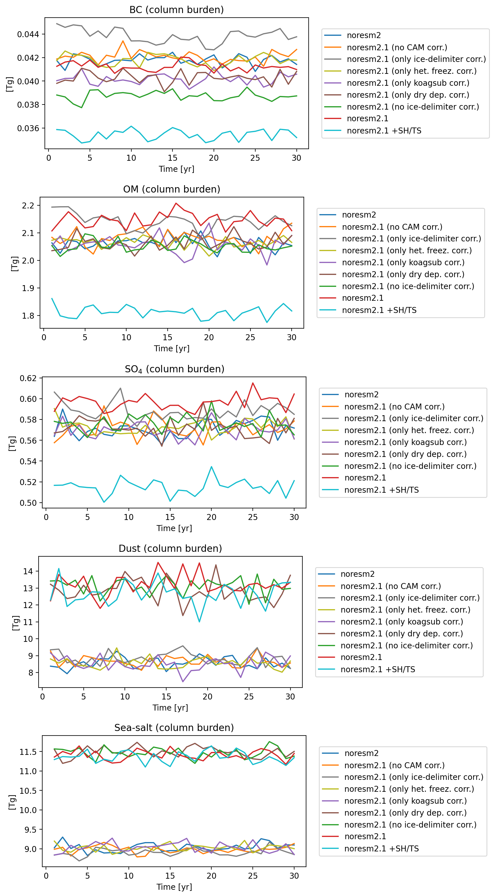

   Global-mean aerosol burden [Tg] of black carbon, organic matter, sulfate, dust and sea-salt in fixed-SST simulations.

.. table:: Global total aerosol burden :math:`[\textrm{Tg  yr}^{-1}]` in fixed-SST simulations.
   :name: tab:fsst_aerosol_burden

   +--------------------------+-------------------+-----------------+-----------------+----------------+----------------+
   |                          |BC                 |OM               |Sulfate          |Dust            |Sea-salt        |
   +--------------------------+-------------------+-----------------+-----------------+----------------+----------------+
   |                          |                                   Uncertainty                                           |
   +--------------------------+-------------------+-----------------+-----------------+----------------+----------------+
   |                          |:math:`\pm 0.0001` |:math:`\pm 0.007`|:math:`\pm 0.002`|:math:`\pm 0.01`|:math:`\pm 0.03`|
   +--------------------------+-------------------+-----------------+-----------------+----------------+----------------+
   |                          |                               Absolute values                                           |
   +--------------------------+-------------------+-----------------+-----------------+----------------+----------------+
   |noresm2 (CMIP6)           |0.0418             |2.064            |0.571            |8.61            |9.03            |
   +--------------------------+-------------------+-----------------+-----------------+----------------+----------------+
   |noresm2.1 (no CAM  corr.) |0.0421             |2.080            |0.572            |8.67            |8.98            |
   |(no CAM  corr.)           |                   |                 |                 |                |                |
   +--------------------------+-------------------+-----------------+-----------------+----------------+----------------+
   |noresm2.1                 |0.0437             |2.136            |0.587            |8.83            |8.92            |
   |(only ice-delimiter corr.)|                   |                 |                 |                |                |
   |                          |                   |                 |                 |                |                |
   |                          |                   |                 |                 |                |                |
   |                          |                   |                 |                 |                |                |
   +--------------------------+-------------------+-----------------+-----------------+----------------+----------------+
   |noresm2.1                 |0.0417             |2.063            |0.572            |8.55            |9.03            |
   |(only het.freez. corr.)   |                   |                 |                 |                |                |
   +--------------------------+-------------------+-----------------+-----------------+----------------+----------------+
   |noresm2.1                 |0.0401             |2.058            |0.570            |8.49            |9.05            |
   |(only koagsub corr.)      |                   |                 |                 |                |                |
   +--------------------------+-------------------+-----------------+-----------------+----------------+----------------+
   |noresm2.1                 |0.0403             |2.065            |0.572            |12.86           |11.51           |
   |(only dry dep. corr.)     |                   |                 |                 |                |                |
   +--------------------------+-------------------+-----------------+-----------------+----------------+----------------+
   |noresm2.1                 |0.0388             |2.054            |0.576            |13.08           |11.45           |
   |(no ice-delimiter corr.)  |                   |                 |                 |                |                |
   +--------------------------+-------------------+-----------------+-----------------+----------------+----------------+
   |noresm2.1                 |0.0412             |2.147            |0.596            |13.23           |11.40           |
   +--------------------------+-------------------+-----------------+-----------------+----------------+----------------+
   |noresm2.1                 |0.0354             |1.813            |0.515            |12.67           |11.36           |
   |+ SH/TS                   |                   |                 |                 |                |                |
   +--------------------------+-------------------+-----------------+-----------------+----------------+----------------+
   |                          |                   Comparison w.r.t. noresm2 (CMIP6)                                     |
   +--------------------------+-------------------+-----------------+-----------------+----------------+----------------+
   |noresm2                   |–                  |–                |–                |–               |–               |
   |(CMIP6)                   |                   |                 |                 |                |                |
   +--------------------------+-------------------+-----------------+-----------------+----------------+----------------+
   |noresm2.1                 |0.0003             |0.016            |0.001            |0.06            |-0.04           |
   |(no CAM corr.)            |                   |                 |                 |                |                |
   +--------------------------+-------------------+-----------------+-----------------+----------------+----------------+
   |noresm2.1                 |0.0019             |0.072            |0.016            |0.22            |-0.10           |
   |(only ice-delimiter corr.)|                   |                 |                 |                |                |
   +--------------------------+-------------------+-----------------+-----------------+----------------+----------------+
   |noresm2.1                 |-0.00003           |-0.001           |0.001            |-0.07           |-0.002          |
   |(only het. freez. corr.)  |                   |                 |                 |                |                |
   +--------------------------+-------------------+-----------------+-----------------+----------------+----------------+
   |noresm2.1                 |-0.0016            |-0.006           |-0.001           |-0.12           |0.03            |
   |(only koagsub corr.)      |                   |                 |                 |                |                |
   +--------------------------+-------------------+-----------------+-----------------+----------------+----------------+
   |noresm2.1                 |-0.0015            |0.001            |0.001            |4.25            |2.48            |
   |(only dry dep. corr.)     |                   |                 |                 |                |                |
   +--------------------------+-------------------+-----------------+-----------------+----------------+----------------+
   |noresm2.1                 |-0.0030            |-0.010           |0.005            |4.47            |2.43            |
   |(no ice-delimiter corr.)  |                   |                 |                 |                |                |
   +--------------------------+-------------------+-----------------+-----------------+----------------+----------------+
   |noresm2.1                 |-0.0006            |0.083            |0.025            |4.61            |2.37            |
   +--------------------------+-------------------+-----------------+-----------------+----------------+----------------+
   |noresm2.1                 |-0.0063            |-0.251           |-0.056           |4.06            |2.33            |
   |+ SH/TS                   |                   |                 |                 |                |                |
   +--------------------------+-------------------+-----------------+-----------------+----------------+----------------+
   |                          |                   |                 |                 |                |                |
   +--------------------------+-------------------+-----------------+-----------------+----------------+----------------+

Aerosol lifetime
~~~~~~~~~~~~~~~~

The global-mean aerosol lifetimes are shown in
Fig. :numref:`fig:fsst_aerosol_lifetime` and
Table :numref:`tab:fsst_aerosol_lifetime`. The changes visible in the
global aerosol burden are reflected in the lifetime changes (although
emission changes mostly impact the burden but not the lifetime).

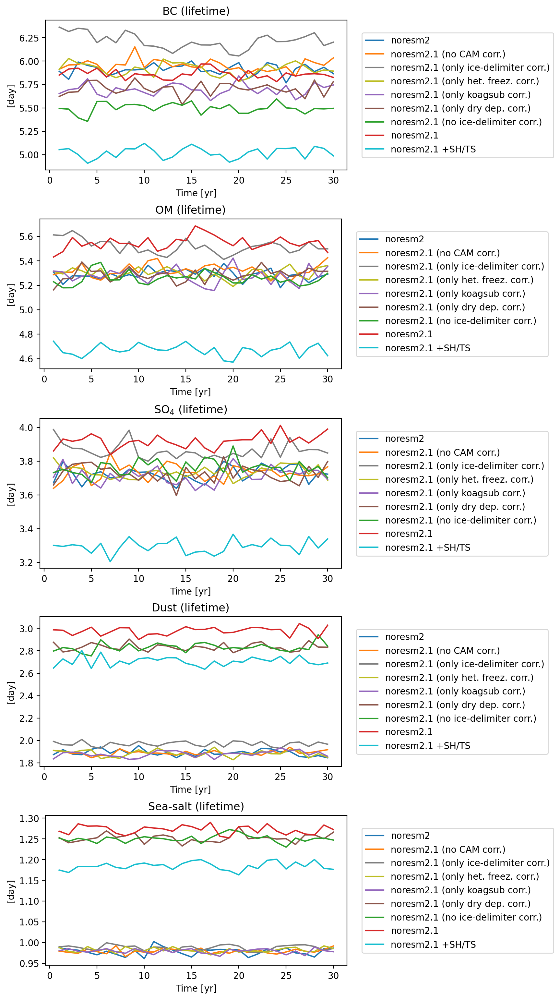

   Global-mean aerosol lifetime [day] of black carbon, organic matter, sulfate, dust and sea-salt in fixed-SST simulations.

.. table:: Global-mean aerosol life time [day] in fixed-SST simulations.
   :name: tab:fsst_aerosol_lifetime

   +-------------+-----------------+-----------------+-----------------+-----------------+------------------+
   |             |BC               |OM               |Sulfate          |Dust             |Sea-salt          |
   +-------------+-----------------+-----------------+-----------------+-----------------+------------------+
   |             |                         Uncertainty                                                      |
   +-------------+-----------------+-----------------+-----------------+-----------------+------------------+
   |Uncertainty  |:math:`\pm\,0.01`|:math:`\pm\,0.01`|:math:`\pm\,0.01`|:math:`\pm\,0.01`|:math:`\pm\,0.002`|
   +-------------+-----------------+-----------------+-----------------+-----------------+------------------+
   |             |                                   Absolute values                                        |
   +-------------+-----------------+-----------------+-----------------+-----------------+------------------+
   |noresm2      |5.91             |5.29             |3.725            |1.90             |0.978             |
   |(CMIP6)      |                 |                 |                 |                 |                  |
   +-------------+-----------------+-----------------+-----------------+-----------------+------------------+
   |noresm2.1    |5.96             |5.32             |3.734            |1.89             |0.980             |
   |(no CAM      |                 |                 |                 |                 |                  |
   |corr.)       |                 |                 |                 |                 |                  |
   +-------------+-----------------+-----------------+-----------------+-----------------+------------------+
   |noresm2.1    |6.20             |5.50             |3.855            |1.97             |0.988             |
   |(only        |                 |                 |                 |                 |                  |
   |ice-delimiter|                 |                 |                 |                 |                  |
   |corr.)       |                 |                 |                 |                 |                  |
   +-------------+-----------------+-----------------+-----------------+-----------------+------------------+
   |noresm2.1    |5.91             |5.30             |3.730            |1.88             |0.982             |
   |(only        |                 |                 |                 |                 |                  |
   |het.         |                 |                 |                 |                 |                  |
   |freez.       |                 |                 |                 |                 |                  |
   |corr.)       |                 |                 |                 |                 |                  |
   +-------------+-----------------+-----------------+-----------------+-----------------+------------------+
   |noresm2.1    |5.69             |5.28             |3.711            |1.88             |0.979             |
   |(only        |                 |                 |                 |                 |                  |
   |koagsub      |                 |                 |                 |                 |                  |
   |corr.)       |                 |                 |                 |                 |                  |
   +-------------+-----------------+-----------------+-----------------+-----------------+------------------+
   |noresm2.1    |5.71             |5.29             |3.723            |2.83             |1.253             |
   |(only        |                 |                 |                 |                 |                  |
   |dry dep.     |                 |                 |                 |                 |                  |
   |corr.)       |                 |                 |                 |                 |                  |
   +-------------+-----------------+-----------------+-----------------+-----------------+------------------+
   |noresm2.1    |5.51             |5.27             |3.762            |2.84             |1.251             |
   |(no          |                 |                 |                 |                 |                  |
   |ice-delimiter|                 |                 |                 |                 |                  |
   |corr.)       |                 |                 |                 |                 |                  |
   +-------------+-----------------+-----------------+-----------------+-----------------+------------------+
   |noresm2.1    |5.86             |5.55             |3.921            |2.98             |1.272             |
   +-------------+-----------------+-----------------+-----------------+-----------------+------------------+
   |noresm2.1    |5.02             |4.67             |3.294            |2.71             |1.186             |
   |+ SH/TS      |                 |                 |                 |                 |                  |
   +-------------+-----------------+-----------------+-----------------+-----------------+------------------+
   |             |                            Change w.r.t. NorESM2 (CMIP6)                                 |
   +-------------+-----------------+-----------------+-----------------+-----------------+------------------+
   |noresm2      |–                |–                |–                |–                |–                 |
   |(CMIP6)      |                 |                 |                 |                 |                  |
   +-------------+-----------------+-----------------+-----------------+-----------------+------------------+
   |noresm2.1    |0.05             |0.03             |0.01             |-0.002           |0.002             |
   |(no CAM      |                 |                 |                 |                 |                  |
   |corr.)       |                 |                 |                 |                 |                  |
   +-------------+-----------------+-----------------+-----------------+-----------------+------------------+
   |noresm2.1    |0.28             |0.21             |0.13             |0.07             |0.010             |
   |(only        |                 |                 |                 |                 |                  |
   |ice-d        |                 |                 |                 |                 |                  |
   |elimiter     |                 |                 |                 |                 |                  |
   |corr.)       |                 |                 |                 |                 |                  |
   +-------------+-----------------+-----------------+-----------------+-----------------+------------------+
   |noresm2.1    |-0.005           |0.006            |0.005            |-0.01            |0.004             |
   |(only        |                 |                 |                 |                 |                  |
   |het.         |                 |                 |                 |                 |                  |
   |freez.       |                 |                 |                 |                 |                  |
   |corr.)       |                 |                 |                 |                 |                  |
   +-------------+-----------------+-----------------+-----------------+-----------------+------------------+
   |noresm2.1    |-0.22            |-0.01            |-0.01            |-0.01            |0.001             |
   |(only        |                 |                 |                 |                 |                  |
   |koagsub      |                 |                 |                 |                 |                  |
   |corr.)       |                 |                 |                 |                 |                  |
   +-------------+-----------------+-----------------+-----------------+-----------------+------------------+
   |noresm2.1    |-0.20            |-0.0002          |-0.001           |0.94             |0.275             |
   |(only        |                 |                 |                 |                 |                  |
   |dry dep.     |                 |                 |                 |                 |                  |
   |corr.)       |                 |                 |                 |                 |                  |
   +-------------+-----------------+-----------------+-----------------+-----------------+------------------+
   |noresm2.1    |-0.40            |-0.02            |0.04             |0.94             |0.273             |
   |(no          |                 |                 |                 |                 |                  |
   |ice-delimiter|                 |                 |                 |                 |                  |
   |corr.)       |                 |                 |                 |                 |                  |
   +-------------+-----------------+-----------------+-----------------+-----------------+------------------+
   |noresm2.1    |-0.05            |0.26             |0.20             |1.09             |0.294             |
   +-------------+-----------------+-----------------+-----------------+-----------------+------------------+
   |noresm2.1    |-0.89            |-0.62            |-0.43            |0.81             |0.208             |
   |+ SH/TS      |                 |                 |                 |                 |                  |
   +-------------+-----------------+-----------------+-----------------+-----------------+------------------+
   |             |                 |                 |                 |                 |                  |
   +-------------+-----------------+-----------------+-----------------+-----------------+------------------+

ERF estimates
-------------

The aerosol effective radiative forcing (ERF) is obtained by the
difference in the TOA imbalance in an NF1850norbc_aer2014 simulation
(fixed-SST, 1850 conditions except for 2014 aerosol emissions) and the
correspondign N1850norbc simulation (fixed-SST, 1850 conditions).

When going from NorESM2 to NorESM2.1 the aerosol ERF becomes slightly
weaker, changing form -1.37\ :math:`\pm`\ 0.06 :math:`\textrm{W m}^{-2}` to
-1.22\ :math:`\pm`\ 0.09 :math:`\textrm{W m}^{-2}`. The aerosol ERF in NorESM2
was known to be reasonably strong compared to other model estimates.

.. table:: Aerosol effective radiative forcing (ERF) for a limited number of experiments.

   +-------------+----------------------------+----------------------------+----------------------------+----------------------------+
   |             |ERF                         |ERF(ari)                    |ERF(aci)                    |ERF(alb)                    |
   +-------------+----------------------------+----------------------------+----------------------------+----------------------------+
   |             |:math:`[\textrm{W  m}^{-2}]`|:math:`[\textrm{W  m}^{-2}]`|:math:`[\textrm{W  m}^{-2}]`|:math:`[\textrm{W  m}^{-2}]`|
   +-------------+----------------------------+----------------------------+----------------------------+----------------------------+
   |noresm2      |:math:`-1.37\,\pm\,0.06`    |:math:`0.04\,\pm\,0.01`     |:math:`-1.35\,\pm\,0.06`    |:math:`-0.06\,\pm\,0.03`    |
   |(CMIP6)      |                            |                            |                            |                            |
   +-------------+----------------------------+----------------------------+----------------------------+----------------------------+
   |noresm2.1    |:math:`-1.17\,\pm\,0.08`    |:math:`0.05\,\pm\,0.01`     |:math:`-1.21\,\pm\,0.06`    |:math:`-0.02\,\pm\,0.03`    |
   |(no          |                            |                            |                            |                            |
   |ice-delimiter|                            |                            |                            |                            |
   |corr.)       |                            |                            |                            |                            |
   +-------------+----------------------------+----------------------------+----------------------------+----------------------------+
   |noresm2.1    |:math:`-1.22\,\pm\,0.09`    |:math:`0.08\,\pm\,0.01`     |:math:`-1.37\,\pm\,0.07`    |:math:`0.06\,\pm\,0.04`     |
   +-------------+----------------------------+----------------------------+----------------------------+----------------------------+
   |noresm2.1 +  |:math:`-1.43\,\pm\,0.10`    |:math:`0.01\,\pm\,0.01`     |:math:`-1.44\,\pm\,0.07`    |:math:`-0.00\,\pm\,0.04`    |
   |SH/TS        |                            |                            |                            |                            |
   +-------------+----------------------------+----------------------------+----------------------------+----------------------------+
   |             |                            |                            |                            |                            |
   +-------------+----------------------------+----------------------------+----------------------------+----------------------------+

.. _subsection:results_cpl:

Coupled simulations
-------------------

In the figures shown here, we have used an 11-year running average. All
figures show global mean values, except for the surface (2 m) air
temperature (additionally also northern and southern hemisphere are
shown), and the figure on AMOC.

Surface (2 m) air temperature
~~~~~~~~~~~~~~~~~~~~~~~~~~~~~

Figure :numref:`fig:cpl_trefht` shows the surface (2 m) air temperature
averaged globally (upper panel), in the northern hemisphere (middle
panel), and in the southern hemisphere (lower panel). NorESM2.1 shows a
slighly higher surface (2 m) air temperature, mainly in the SH.
*noresm2+SH/TS* shows colder surface (2 m) air temperatures, mainly in
the SH.

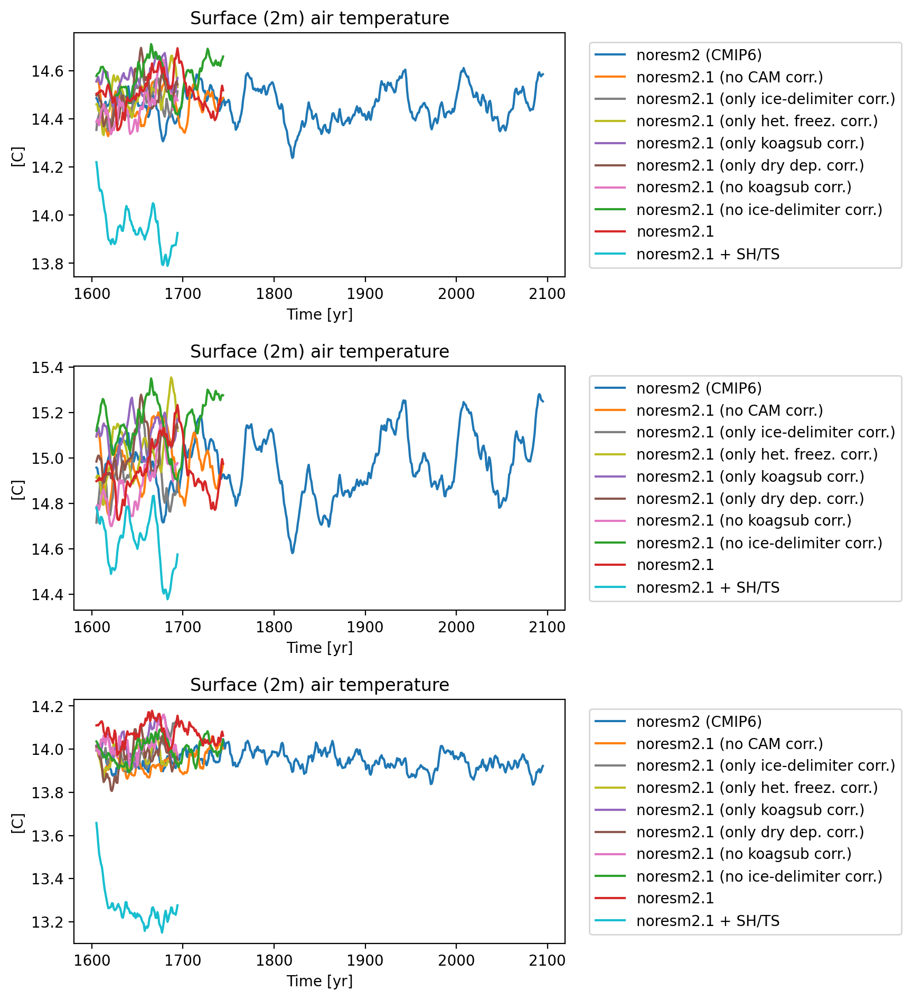

   Global, northern hemisphere and southern hemispshere surface (:math:`2\,\textrm{ m}`) air temperature :math:`[^\circ C]` in fully-coupled simulations.

Mean ocean volume temperature
~~~~~~~~~~~~~~~~~~~~~~~~~~~~~

Figure :numref:`fig:cpl_tempocn` shows the volume-mean ocean
temperature. NorESM2 and *no CAM corr.* show very similar behaviour,
i.e., a small negative trend. The simulations containing *koagsub corr.*
(i.e, *NorESM2.1*, *no ice-delimiter corr.* and *only koagsub corr.*)
all show a mitigated positive trend.

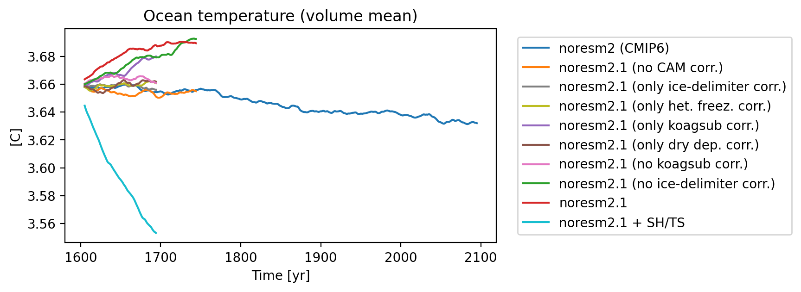

   Global-mean ocean volume temperature :math:`[^\circ C]` in
   fully-couple simulations.

.. _toa-imbalance-1:

TOA imbalance
~~~~~~~~~~~~~

Figure :numref:`fig:cpl_fslnt` shows the TOA radiative imbalance in the
fully-coupled simulations.

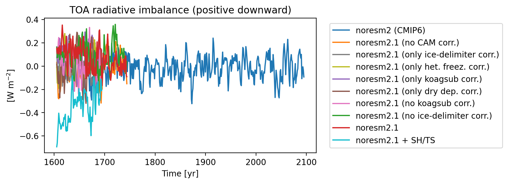

   Global-mean TOA imbalance :math:`[\textrm{W m}^{-2}]` in fully-coupled simulations.

Table :numref:`tbl:cpl_fslnt` shows the TOA radiative imbalance
averaged over the first 100 yr of the simulations (1600–1699).

.. table:: Global-mean TOA imbalance :math:`[\textrm{W m}^{-2}]` and surface (2 m) air temperature :math:`[^\circ C]` averaged over year 1600–1679 of the fully-coupled simulations.
   :name: tbl:cpl_fslnt

   +--------------------+---------------------------+------------------+
   |Code                |TOA imbalance              |Surface (2 m) air |
   |                    |                           |temperature       |
   +--------------------+---------------------------+------------------+
   |                    |:math:`[\textrm{W m}^{-2}]`|:math:`[^\circ C]`|
   +--------------------+---------------------------+------------------+
   |noresm2 (CMIP6)     |-0.01                      |14.45             |
   +--------------------+---------------------------+------------------+
   |noresm2.1 (no CAM   |-0.01                      |14.47             |
   |corr.)              |                           |                  |
   +--------------------+---------------------------+------------------+
   |noresm2.1 (no       |0.09                       |14.57             |
   |ice-delimiter corr.)|                           |                  |
   +--------------------+---------------------------+------------------+
   |noresm2.1           |0.12                       |14.51             |
   +--------------------+---------------------------+------------------+
   |noresm2.1 + SH/TS   |-0.40                      |13.97             |
   +--------------------+---------------------------+------------------+
   |                    |                           |                  |
   +--------------------+---------------------------+------------------+

AMOC strength
~~~~~~~~~~~~~

Figure :numref:`fig:cpl_amoc` shows the AMOC at :math:`26.0^\circ\ \textrm{ N}`.

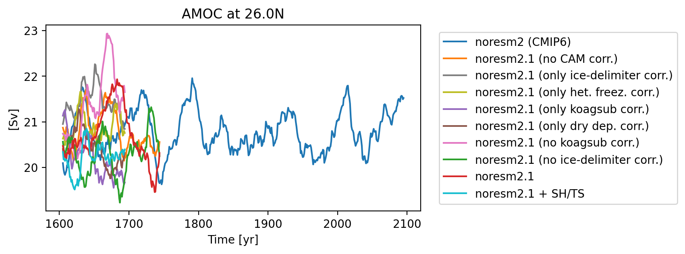

   Atlantic meridional overturning circulation [Sv] in fully-coupled simulations.

SWCF and LWCF in coupled simulations
~~~~~~~~~~~~~~~~~~~~~~~~~~~~~~~~~~~~

Figure :numref:`fig:cpl_swcf_lwcf` shows the global-mean SWCF (upper
panel) and LWCF (lower panel).

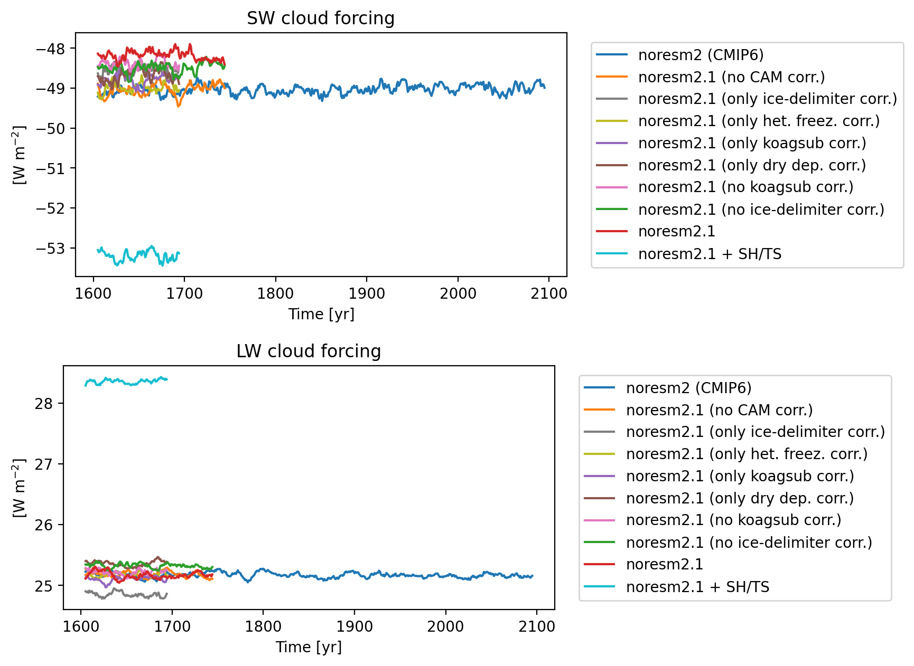

   Global-mean SWCF and LWCF :math:`[\textrm{W m}^{-2}]` in fully-coupled simulations.

.. _surface-wind-and-dms-emissions-1:

Surface wind and DMS emissions
~~~~~~~~~~~~~~~~~~~~~~~~~~~~~~

Figure :numref:`fig:cpl_u10_sfdms` shows the global averaged surface
(10 m) wind (left panel) and the global total DMS emissions (right
panel).

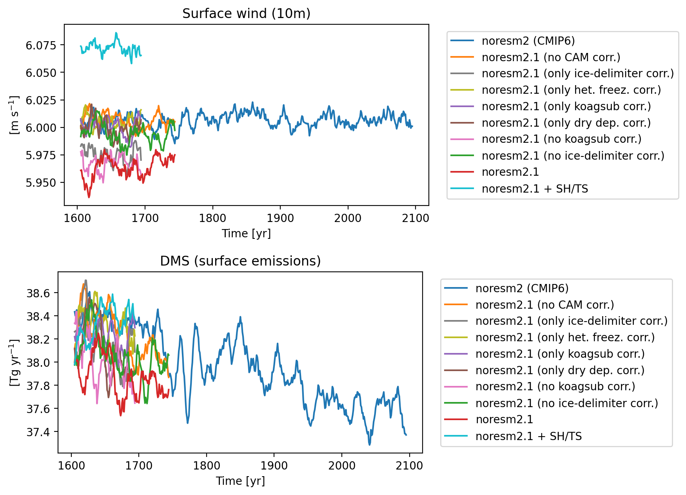

   Global-mean surface (10 m) wind :math:`[\textrm{m s}^{-1}]` and DMS emission strenght :math:`[\textrm{Tg yr}^{-1}]` in fully-coupled simulations.

Ice and cloud droplet number
~~~~~~~~~~~~~~~~~~~~~~~~~~~~

Figure :numref:`fig:cpl_numice_numliq` shows the vertically-integrated
ice crystal number (left) and cloud droplet number (right).

   Global-mean ice crystal and cloud droplet number :math:`[\#\textrm{ m}^{-2}]` (column integrated) in fully-coupled simulations.

Liquid and ice water path
~~~~~~~~~~~~~~~~~~~~~~~~~

Figure :numref:`fig:cpl_iwp_lwp` shows the IWP and LWP.

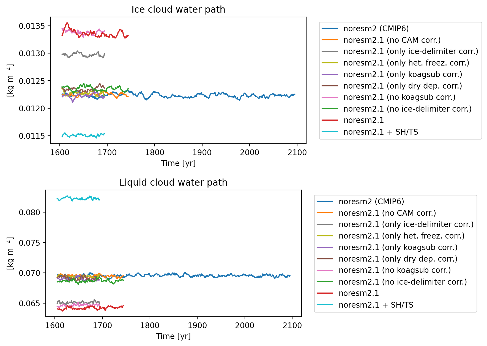

   Global-mean ice and liquid cloud water path :math:`[\textrm{kg  m}^{-2}]` in fully-coupled simulations.

Conclusion
^^^^^^^^^^

We have tried to describe some differences between NorESM2 and
NorESM2.1. We find that the TOA imbalance in fixed-SST simulations is
aroud 0.5 :math:`\textrm{W m}^{-2}` stronger in NorESM2.1 than in NorESM2 – the
strongest contribution comes from the *ice-delimeter corr.*. We observe
a lower LWP in NorESM2.1 compard to NorESM2 (and it was already
reasonably low in NorESM2). The atmospheric burden of dust and sea-salt
aerosol increases considerably in NorESM2.1 compared to NorESM2. The
strenght of the aerosol ERF (negative) is slightly reduced in NorESM2.1
(:math:`-1.22\,\textrm{ W m}^{-2}`) compared in NorESM2 (:math:`-1.37\, \textrm{W m}^{-2}`).
The fully-coupled version of NorESM2.1 shows a mitigated but clear
warming trend in the ocean volume temperature, mainly caused by *koagsub
corr.*. A test with additional changes (*SH/TS*) appeared to give
unsatisfactory results. These changes will however be implemented in
NorESM2.3 including additional parameter tuning.

We think that NorESM2.1 is an interesting model version as several bugs
have been corrected (4 in the atmospheric component CAM-Nor, and a few
minor ones in iHAMOCC). We think that this version is able to be used –
however in fully-coupled simulations one should be aware of possible
drifts. The tests have been run with the LM version only
(:math:`1.9^\circ\,\textrm{x}\,2.5^\circ` atmospheric resolution), but
we expect that the impact of the changes will be similar in the MM
version (:math:`0.9^\circ\,\textrm{x}\,1.25^\circ` atmospheric
resolution).

Experiments
^^^^^^^^^^^

.. table:: Overview of all experiments
   :name: tbl:simulations_details

   +---------------------------+---------------------------+-----------+
   | Code                      | Case name                 | Length    |
   +---------------------------+---------------------------+-----------+
   |                           |                           |           |
   +---------------------------+---------------------------+-----------+
   | noresm2 (CMIP6)           | NF1850norbc_f19_20191025  | 1–30      |
   +---------------------------+---------------------------+-----------+
   | noresm2.1 (no CAM corr.)  | NF1850norb                | 1–30      |
   |                           | c_f19_f19_20231204_test04 |           |
   +---------------------------+---------------------------+-----------+
   | noresm2.1 (only           | NF1850norb                | 1–30      |
   | ice-delimiter corr.)      | c_f19_f19_20231204_test19 |           |
   +---------------------------+---------------------------+-----------+
   | noresm2.1 (only het.      | NF1850norb                | 1–30      |
   | freez. corr.)             | c_f19_f19_20231204_test11 |           |
   +---------------------------+---------------------------+-----------+
   | noresm2.1 (only koagsub   | NF1850norb                | 1–30      |
   | corr.)                    | c_f19_f19_20231204_test12 |           |
   +---------------------------+---------------------------+-----------+
   | noresm2.1 (only dry dep.  | NF1850norb                | 1–30      |
   | corr.)                    | c_f19_f19_20231204_test13 |           |
   +---------------------------+---------------------------+-----------+
   | **noresm2.1 (no           | **NF1850norbc_            | 1–30      |
   | ice-delimiter corr.)**    | f19_f19_20231204_test02** |           |
   +---------------------------+---------------------------+-----------+
   | **noresm2.1**             | **NF1850norbc_            | 1–30      |
   |                           | f19_f19_20231204_test17** |           |
   +---------------------------+---------------------------+-----------+
   | noresm2.1 + SH/TS         | NF1850norb                | 1–30      |
   |                           | c_f19_f19_20231204_test18 |           |
   +---------------------------+---------------------------+-----------+
   |                           |                           |           |
   +---------------------------+---------------------------+-----------+
   | noresm2 (CMIP6)           | NF1850n                   | 1–30      |
   |                           | orbc_aer2014_f19_20191025 |           |
   +---------------------------+---------------------------+-----------+
   | noresm2.1 (only           | NF1850norb                | 1–30      |
   | ice-delimiter corr.)      | c_f19_f19_20231204_test19 |           |
   +---------------------------+---------------------------+-----------+
   | **noresm2.1 (no           | **NF1850norbc_            | 1–30      |
   | ice-delimiter corr.)**    | f19_f19_20231204_test02** |           |
   +---------------------------+---------------------------+-----------+
   | **noresm2.1**             | **NF1850norbc_            | 1–30      |
   |                           | f19_f19_20231204_test17** |           |
   +---------------------------+---------------------------+-----------+
   |                           |                           |           |
   +---------------------------+---------------------------+-----------+
   | noresm2 (CMIP6)           | N1850_f19_tn14_20190621   | 1600–2099 |
   +---------------------------+---------------------------+-----------+
   | noresm2.1 (no CAM corr.)  | N1850                     | 1600–1749 |
   |                           | _f19_tn14_20231204_test05 |           |
   +---------------------------+---------------------------+-----------+
   | noresm2.1 (only           | N1850                     | 1600–1699 |
   | ice-delimiter corr.)      | _f19_tn14_20231204_test15 |           |
   +---------------------------+---------------------------+-----------+
   | noresm2.1 (only het.      | N1850                     | 1600–1699 |
   | freez. corr.)             | _f19_tn14_20231204_test16 |           |
   +---------------------------+---------------------------+-----------+
   | noresm2.1 (only koagsub   | N1850                     | 1600–1699 |
   | corr.)                    | _f19_tn14_20231204_test14 |           |
   +---------------------------+---------------------------+-----------+
   | noresm2.1 (only dry dep.  | N1850                     | 1600–1699 |
   | corr.)                    | _f19_tn14_20231204_test17 |           |
   +---------------------------+---------------------------+-----------+
   | noresm2.1 (no koagsub     | N1850                     | 1600–1749 |
   | corr.)                    | _f19_tn14_20231204_test13 |           |
   +---------------------------+---------------------------+-----------+
   | noresm2.1 (no             | N1850                     | 1600–1749 |
   | ice-delimiter corr.)      | _f19_tn14_20231204_test03 |           |
   +---------------------------+---------------------------+-----------+
   | noresm2.1                 | N1850                     | 1600–1749 |
   |                           | _f19_tn14_20231204_test11 |           |
   +---------------------------+---------------------------+-----------+
   | noresm2.1 + SH/TS         | N1850                     | 1600–1699 |
   |                           | _f19_tn14_20231204_test12 |           |
   +---------------------------+---------------------------+-----------+
   |                           |                           |           |
   +---------------------------+---------------------------+-----------+
